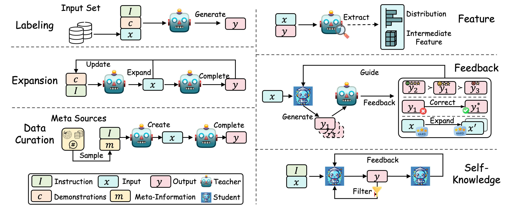
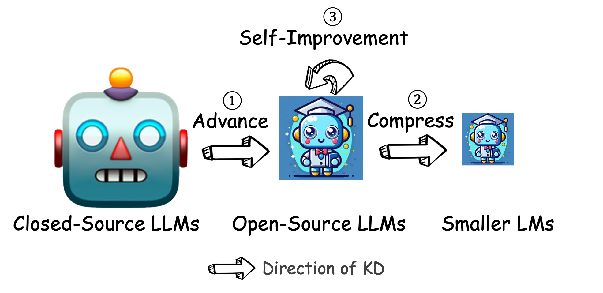

# Awesome Knowledge Distillation of LLM Papers
[]() 
 
[](https://arxiv.org/abs/2402.13116)


<!-- Big font size -->
<h2 align="center">
A Survey on Knowledge Distillation of Large Language Models
</h2> 


<p align="center">
  Xiaohan Xu<sup>1</sup>&nbsp&nbsp
    Ming Li<sup>2</sup>&nbsp&nbsp
    Chongyang Tao<sup>3</sup>&nbsp&nbsp
    Tao Shen<sup>4</sup>&nbsp&nbsp
    Reynold Cheng<sup>1</sup>&nbsp&nbsp
    Jinyang Li<sup>1</sup>&nbsp&nbsp
    Can Xu<sup>5</sup>&nbsp&nbsp
    Dacheng Tao<sup>6</sup>&nbsp&nbsp
    Tianyi Zhou<sup>2</sup>&nbsp&nbsp
</p>  


<p align="center">
<sup>1</sup> The University of Hong Kong &nbsp&nbsp
<sup>2</sup> University of Maryland &nbsp&nbsp
<sup>3</sup> Microsoft &nbsp&nbsp
<sup>4</sup> University of Technology Sydney &nbsp&nbsp
<sup>5</sup> Peking University &nbsp&nbsp
<sup>6</sup> The University of Sydney
</p>
<div align="center">
  <br>
</div>
<br>

*A collection of papers related to knowledge distillation of large language models (LLMs). 
If you want to use LLMs for benefitting your own smaller models training, just take a look at this collection.*

> ❗️Legal Consideration: It's crucial to note the legal implications of utilizing LLM outputs, such as those from ChatGPT ([Restrictions](https://openai.com/policies/business-terms)), Llama ([License](https://llama.meta.com/llama-downloads/)), etc. We strongly advise users to adhere to the terms of use specified by the model providers, such as the restrictions on developing competitive products, and so on. This underscores the importance of understanding and complying with legal guidelines when employing KD techniques with LLMs.


## 💡 News
- **2024-2-20**: 📃 We released a survey paper "**[A Survey on Knowledge Distillation of Large Language Models](https://arxiv.org/abs/2402.13116)**". Welcome to read and cite it. We are looking forward to your feedback and suggestions.


## Contributing to This Collection

Feel free to **open an issue/PR** or e-mail [shawnxxh@gmail.com](mailto:shawnxxh@gmail.com), [minglii@umd.edu](mailto:minglii@umd.edu), [hishentao@gmail.com](mailto:hishentao@gmail.com) and [chongyangtao@gmail.com](mailto:chongyangtao@gmail.com) if you find any missing taxonomies or papers. We will keep updating this collection and survey.

## 📝 Introduction
**KD of LLMs**: This survey delves into knowledge distillation (KD) techniques in Large Language Models (LLMs), highlighting KD's crucial role in transferring advanced capabilities from proprietary LLMs like GPT-4 to open-source counterparts such as LLaMA and Mistral. We also explore how KD enables the compression and self-improvement of open-source LLMs by using them as teachers. 

**KD and Data Augmentation**: Crucially, the survey navigates the intricate interplay between data augmentation (DA) and KD, illustrating how DA emerges as a powerful paradigm within the KD framework to bolster LLMs' performance. By leveraging DA to generate context-rich, skill-specific training data, KD transcends traditional boundaries, enabling open-source models to approximate the contextual adeptness, ethical alignment, and deep semantic insights characteristic of their proprietary counterparts. 

**Taxonomy**: Our analysis is meticulously structured around three foundational pillars: **[algorithm](#kd-algorithms)**, **[skill](#skill-distillation)**, and **[verticalization](#verticalization-distillation)** -- providing a comprehensive examination of KD mechanisms, the enhancement of specific cognitive abilities, and their practical implications across diverse fields. 


**[KD Algorithms](#kd-algorithms)**:  For KD algorithms, we categorize it into two principal steps: "Knowledge Elicitation" focusing on eliciting knowledge from teacher LLMs, and "Distillation Algorithms" centered on injecting this knowledge into student models. 

<div align="center">
  <br>
  <em>Figure: An illustration of different knowledge elicitation methods from teacher LLMs.</em>
</div>
<br>


**[Skill Distillation](#skill-distillation)**:  We delve into the enhancement of specific cognitive abilities, such as context following, alignment, agent, NLP task specialization, and multi-modality.

**[Verticalization Distillation](#verticalization-distillation)**: We explore the practical implications of KD across diverse fields, including law, medical & healthcare, finance, science, and miscellaneous domains.


> Note that both [Skill Distillation]((#skill-distillation)) and [Verticalization Distillation](#verticalization-distillation) employ Knowledge Elicitation and Distillation Algorithms in [KD Algorithms](#kd-algorithms) to achieve their KD. Thus, there are overlaps between them. However, this could also provide different perspectives for the papers.


## Why KD of LLMs?
In the era of LLMs, KD of LLMs plays the following crucial roles:

<div align="center">
  <br>
</div>
<br>

|  Role  |   Description  |   Trend   |
|:--------|:--------:|:--------:|
| **① Advancing Smaller Models** | Transferring advanced capabilities from proprietary LLMs to smaller models, such as open source LLMs or other smaller models. | Most common |
| **② Compression** | Compressing open-source LLMs to make them more efficient and practical.  |  More popular with the prosperity of open-source LLMs |
| **③ Self-Improvement** | Refining open-source LLMs' performance by leveraging their own knowledge, i.e. self-knowledge. | New trend to make open-source LLMs more competitive |


## 📒 Table of Contents
- [KD Algorithms](#kd-algorithms)
    - [Knowledge Elicitation](#knowledge-elicitation)
        - [Labeling](#labeling)
        - [Expansion](#expansion)
        - [Curation](#curation)
        - [Feature](#feature)
        - [Feedback](#feedback)
        - [Self-Knowledge](#self-knowledge)
    - [Distillation Algorithms](#distillation-algorithms)
        - [Supervised Fine-Tuning](#supervised-fine-tuning)
        - [Divergence and Similarity](#divergence-and-similarity)
        - [Reinforcement Learning](#reinforcement-learning)
        - [Rank Optimization](#rank-optimization)
- [Skill Distillation](#skill-distillation)
    - [Context Following](#context-following)
        - [Instruction Following](#instruction-following)
        - [Multi-turn Dialogue](#multi-turn-dialogue)
        - [RAG Capability](#rag-capability)
    - [Alignment](#alignment)
        - [Thinking Pattern](#thinking-pattern)
        - [Preference](#preference)
        - [Value](#value)
    - [Agent](#agent)
        - [Tool Using](#tool-using)
        - [Planning](#planning)
    - [NLP Task Specialization](#nlp-task-specialization)
        - [NLU](#nlu)
        - [NLG](#nlg)
        - [Information Retrieval](#information-retrieval)
        - [Recommendation](#recommendation)
        - [Text Generation Evaluation](#text-generation-evaluation)
        - [Code](#code)
    - [Multi-Modality](#multi-modality)
    - [Summary Table](#summary-table)
- [Verticalization Distillation](#verticalization-distillation)
    - [Law](#law)
    - [Medical & Healthcare](#medical--healthcare)
    - [Finance](#finance)
    - [Science](#science)
    - [Misc.](#misc)

- [Citation](#citation)


## KD Algorithms
### Knowledge Elicitation
#### Labeling
|  Title  |   Venue  |   Date   | Code | Data|
|:--------|:--------:|:--------:|:--------:|:--------:|
| [**Mixed Distillation Helps Smaller Language Model Better Reasoning**](https://arxiv.org/pdf/2312.10730.pdf) | arXiv | 2023-12 |
| [**Tailoring Self-Rationalizers with Multi-Reward Distillation**](https://arxiv.org/pdf/2311.02805.pdf) | arXiv | 2023-11 | [Github](https://inklab.usc.edu/MaRio/)| [Data](https://inklab.usc.edu/MaRio/)|
| [**Orca 2: Teaching Small Language Models How to Reason**](https://arxiv.org/pdf/2311.11045.pdf) | arXiv | 2023-11 |
| [**Mammoth: Building Math Generalist Models through Hybrid Instruction Tuning**](https://arxiv.org/abs/2309.05653) | arXiv | 2023-09 | [Github](https://tiger-ai-lab.github.io/MAmmoTH/)| [Data](https://huggingface.co/datasets/TIGER-Lab/MathInstruct)| 
| [**PandaLM: An Automatic Evaluation Benchmark for LLM Instruction Tuning Optimization**](https://arxiv.org/abs/2306.05087) | arXiv | 2023-06 | [Github](https://github.com/WeOpenML/PandaLM)| [Data](https://github.com/WeOpenML/PandaLM)|
| [**Symbolic Chain-of-Thought Distillation: Small Models Can Also "Think" Step-by-Step**](https://arxiv.org/abs/2306.14050) | ACL | 2023-06 | 
| [**Orca: Progressive Learning from Complex Explanation Traces of GPT-4**](https://arxiv.org/abs/2306.02707) | arXiv | 2023-06 | 
| [**Distilling Step-by-Step! Outperforming Larger Language Models with Less Training Data and Smaller Model Sizes**](https://arxiv.org/abs/2305.02301) | ACL | 2023-05 | [Github](https://github.com/google-research/distilling-step-by-step)| [Data](https://github.com/google-research/distilling-step-by-step)|
| [**Impossible Distillation: from Low-Quality Model to High-Quality Dataset & Model for Summarization and Paraphrasing**](https://arxiv.org/abs/2305.16635) | arXiv | 2023-05 | [Github](https://github.com/jaehunjung1/impossible-distillation)|
| [**Baize: An Open-Source Chat Model with Parameter-Efficient Tuning on Self-Chat Data**](https://arxiv.org/abs/2304.01196) | EMNLP | 2023-04 | [Github](https://github.com/project-baize/baize-chatbot)| [Data](https://github.com/project-baize/baize-chatbot/tree/main/data)|
| [**ChatGPT outperforms crowd workers for text-annotation tasks**](https://arxiv.org/pdf/2303.15056.pdf) | arXiv | 2023-03 | 
| [**Annollm: Making large language models to be better crowdsourced annotators**](https://arxiv.org/abs/2303.16854) | arXiv | 2023-03 |
| [**GPT-4All: Training an Assistant-Style Chatbot with Large Scale Data Distillation from GPT-3.5-Turbo**](https://s3.amazonaws.com/static.nomic.ai/gpt4all/2023_GPT4All_Technical_Report.pdf) | - | 2023-03 | [Github](https://github.com/nomic-ai/gpt4all)|
| [**Specializing Smaller Language Models towards Multi-Step Reasoning**](https://arxiv.org/abs/2301.12726) | arXiv | 2023-01 |
|  [**Is GPT-3 a Good Data Annotator?**](https://arxiv.org/pdf/2212.10450.pdf) | ACL | 2022-12 | [Github](https://github.com/DAMO-NLP-SG/LLM-Data-Annotator)|
| [**Large Language Models Are Reasoning Teachers**](https://arxiv.org/abs/2212.10071) | ACL | 2022-12 | [Github](https://github.com/itsnamgyu/reasoning-teacher)| [Data](https://github.com/itsnamgyu/reasoning-teacher)|
| [**Teaching Small Language Models to Reason**](https://arxiv.org/abs/2212.08410) | ACL | 2022-12 |
| [**Explanations from Large Language Models Make Small Reasoners Better**](https://arxiv.org/abs/2210.06726) | arXiv | 2022-10 | 
| [**Want To Reduce Labeling Cost? GPT-3 Can Help**](https://aclanthology.org/2021.findings-emnlp.354) | Findings of EMNLP | 2021-08 |


#### Expansion
|  Title  |   Venue  |   Date   | Code | Data|
|:--------|:--------:|:--------:|:--------:|:--------:|
| [**Instruction Fusion: Advancing Prompt Evolution through Hybridization**](https://arxiv.org/pdf/2312.15692.pdf) | arXiv | 2023-12 | 
| [**An Empirical Study of Instruction-tuning Large Language Models in Chinese**](https://arxiv.org/pdf/2310.07328.pdf) | EMNLP | 2023-10 | [Github](https://github.com/PhoebusSi/Alpaca-CoT)| [Data](https://huggingface.co/datasets/QingyiSi/Alpaca-CoT)|
| [**Wizardmath: Empowering mathematical reasoning for large language models via reinforced evol-instruct**](https://arxiv.org/abs/2308.09583) | arXiv | 2023-08 | [Github](https://github.com/nlpxucan/WizardLM)|
| [**Code Llama: Open Foundation Models for Code**](https://arxiv.org/pdf/2308.12950.pdf) | arXiv | 2023-08 | [Github](https://github.com/facebookresearch/codellama)| 
| [**WizardCoder: Empowering Code Large Language Models with Evol-Instruct**](https://arxiv.org/abs/2306.08568) | ICLR | 2023-06 | [Github](https://github.com/nlpxucan/WizardLM) |
| [**Principle-Driven Self-Alignment of Language Models from Scratch with Minimal Human Supervision**](https://proceedings.neurips.cc/paper/2023/hash/0764db1151b936aca59249e2c1386101-Abstract-Conference.html) | NeurIPS | 2023-05 | [Github](https://github.com/IBM/Dromedary) | [Data](https://huggingface.co/datasets/zhiqings/dromedary-65b-verbose-clone-v0)|
| [**Targeted Data Generation: Finding and Fixing Model Weaknesses**](https://arxiv.org/pdf/2305.17804.pdf) | ACL | 2023-05 | [Github](https://github.com/ZexueHe/TDG)| 
| [**Wizardlm: Empowering large language models to follow complex instructions**](https://arxiv.org/abs/2304.12244) | ICLR | 2023-04 | [Github](https://github.com/nlpxucan/WizardLM)| [Data](https://huggingface.co/datasets/WizardLM/WizardLM_evol_instruct_70k) <br> [Data](https://huggingface.co/datasets/WizardLM/WizardLM_evol_instruct_V2_196k)|
| [**LaMini-LM: A Diverse Herd of Distilled Models from Large-Scale Instructions**](https://arxiv.org/abs/2304.14402) | arXiv | 2023-04 | [Github](https://github.com/mbzuai-nlp/LaMini-LM?tab=readme-ov-file) | [Data](https://huggingface.co/datasets/MBZUAI/LaMini-instruction)|
| [**Alpaca: Aligning Language Model with Human Preferences**](https://crfm.stanford.edu/2023/03/13/alpaca.html) | - | 2023-03 | [Github](https://github.com/tatsu-lab/stanford_alpaca)| [Data](https://github.com/tatsu-lab/stanford_alpaca/blob/main/alpaca_data.json)|
| Code Alpaca: An Instruction-following LLaMA model for code generation | - | 2023-03 | [Github](https://github.com/sahil280114/codealpaca)| [Data](https://github.com/sahil280114/codealpaca?tab=readme-ov-file#data-release)|
| [**Exploring the Impact of Instruction Data Scaling on Large Language Models: An Empirical Study on Real-World Use Cases**](https://arxiv.org/abs/2303.14742) | arXiv | 2023-03 | [Github](https://github.com/LianjiaTech/BELLE) | [Data](https://huggingface.co/BelleGroup)| 
| [**AugGPT: Leveraging ChatGPT for Text Data Augmentation**](https://arxiv.org/pdf/2302.13007.pdf) | arXiv | 2023-02 | [Github](https://github.com/yhydhx/AugGPT)| 
| [**Self-instruct: Aligning language model with self generated instructions**](https://arxiv.org/abs/2212.10560) | ACL | 2022-12 | [Github](https://github.com/yizhongw/self-instruct)| [Data](https://github.com/yizhongw/self-instruct) |
| [**Symbolic Knowledge Distillation: from General Language Models to Commonsense Models**](https://arxiv.org/pdf/2110.07178.pdf) | NAACL | 2021-10 | [Github](https://github.com/peterwestai2/symbolic-knowledge-distillation) | [Data](https://github.com/peterwestai2/symbolic-knowledge-distillation)|


#### Curation
|  Title  |   Venue  |   Date   | Code | Data|
|:--------|:--------:|:--------:|:--------:|:--------:|
| [**Synthetic Data (Almost) from Scratch: Generalized Instruction Tuning for Language Models**](https://arxiv.org/abs/2402.13064) | arXiv | 2024-02 |
| [**Phi-2: The surprising power of small language models**](https://www.microsoft.com/en-us/research/blog/phi-2-the-surprising-power-of-small-language-models/) | - | 2023-12 |
| [**WaveCoder: Widespread And Versatile Enhanced Instruction Tuning with Refined Data Generation**](https://arxiv.org/abs/2312.14187) | arXiv | 2023-12 |
| [**Magicoder: Source Code Is All You Need**](https://arxiv.org/pdf/2312.02120.pdf) | arXiv | 2023-12 | [Github](https://github.com/ise-uiuc/magicoder) | [Data](https://huggingface.co/datasets/ise-uiuc/Magicoder-OSS-Instruct-75K) <br> [Data](https://huggingface.co/datasets/ise-uiuc/Magicoder-Evol-Instruct-110K)|
| [**MFTCoder: Boosting Code LLMs with Multitask Fine-Tuning**](https://arxiv.org/pdf/2311.02303.pdf) | arXiv | 2023-11 | [Github](https://github.com/codefuse-ai/MFTCOder)| [Data](https://huggingface.co/datasets/codefuse-ai/Evol-instruction-66k) <br> [Data](https://huggingface.co/datasets/codefuse-ai/CodeExercise-Python-27k)|
| [**Textbooks Are All You Need II: Phi-1.5 Technical Report**](https://arxiv.org/pdf/2309.05463.pdf) | arXiv | 2023-09 |
| [**Neural Machine Translation Data Generation and Augmentation using ChatGPT**](https://arxiv.org/pdf/2307.05779.pdf) | arXiv | 2023-07 |
| [**Textbooks Are All You Need: A Large-Scale Instructional Text Data Set for Language Models**](https://arxiv.org/pdf/2306.11644.pdf) | arXiv | 2023-06 | 
| [**Enhancing Chat Language Models by Scaling High-quality Instructional Conversations**](https://arxiv.org/abs/2305.14233) | arXiv | 2023-05 | [Github](https://github.com/thunlp/UltraChat) | [Data](https://huggingface.co/datasets/stingning/ultrachat)|
| [**AugTriever: Unsupervised Dense Retrieval by Scalable Data Augmentation**](https://arxiv.org/pdf/2212.08841.pdf) | arXiv | 2022-12 | [Github](https://github.com/salesforce/AugTriever)
| [**SunGen: Self-Guided Noise-Free Data Generation for Efficient Zero-Shot Learning**](https://arxiv.org/pdf/2205.12679.pdf) | ICLR | 2022-05 | [Github](https://github.com/SumilerGAO/SunGen) 
| [**ZeroGen: Efficient Zero-shot Learning via Dataset Generation**](https://arxiv.org/pdf/2202.07922.pdf) | EMNLP | 2022-02 | [Github](https://github.com/jiacheng-ye/ZeroGen)|
| [**InPars: Data Augmentation for Information Retrieval using Large Language Models**](https://arxiv.org/pdf/2202.05144.pdf) | arXiv | 2022-02 | [Github](https://github.com/zetaalphavector/inpars)| [Data](https://github.com/zetaalphavector/inpars)|
| [**Towards Zero-Label Language Learning**](https://arxiv.org/pdf/2109.09193.pdf) | arXiv | 2021-09 | 


#### Feature

|  Title  |   Venue  |   Date   | Code | Data|
|:--------|:--------:|:--------:|:--------:|:--------:|
| [**Towards Cross-Tokenizer Distillation: the Universal Logit Distillation Loss for LLMs**](https://arxiv.org/pdf/2402.12030.pdf) | arXiv | 2024-02 |
| [**Revisiting Knowledge Distillation for Autoregressive Language Models**](https://arxiv.org/pdf/2402.11890.pdf) | arXiv | 2024-02 |
| [**Knowledge Fusion of Large Language Models**](https://arxiv.org/abs/2401.10491) | ICLR | 2024-01 | [Github](https://github.com/fanqiwan/FuseLLM ) 
| [**Improving In-context Learning via Bidirectional Alignment**](https://arxiv.org/pdf/2312.17055.pdf) | arXiv | 2023-12 
| [**Towards the Fundamental Limits of Knowledge Transfer over Finite Domains**](https://arxiv.org/abs/2310.07838) | NeurIPS | 2023-10 |
| [**Baby Llama: Knowledge Distillation from an Ensemble of Teachers Trained on a Small Dataset with No Performance Penalty**](https://arxiv.org/pdf/2308.02019.pdf) | CoNLL | 2023-08 | [Github](https://github.com/timinar/BabyLlama) | [Data](https://github.com/timinar/BabyLlama )|
| [**f-Divergence Minimization for Sequence-Level Knowledge Distillation**](https://arxiv.org/pdf/2307.15190.pdf) | ACL | 2023-07 | [Github](https://github.com/MANGA-UOFA/fdistill) | [Data](https://drive.google.com/file/d/1V7bPndyoTQxcJ6m1BoXAw7-ub-jv8Wh1/view?usp=sharing)|
| [**MiniLLM: Knowledge Distillation of Large Language Models**](https://arxiv.org/pdf/2306.08543.pdf) | ICLR | 2023-06 | [Github](https://github.com/microsoft/LMOps/tree/main/minillm) | [Data](https://github.com/microsoft/LMOps/tree/main/minillm) |
| [**On-Policy Distillation of Language Models: Learning from Self-Generated Mistakes**](https://arxiv.org/pdf/2306.13649.pdf) | ICLR | 2023-06 |
| [**LLM-QAT: Data-Free Quantization Aware Training for Large Language Models**](https://arxiv.org/pdf/2305.17888.pdf) | arXiv | 2023-05 | [Github](https://github.com/facebookresearch/LLM-QAT)| [Data](https://github.com/facebookresearch/LLM-QAT)|
| [**Less is more: Task-aware layer-wise distillation for language model compression**](https://arxiv.org/pdf/2210.01351.pdf) | PMLR | 2022-10 | [Github](https://github.com/cliang1453/task-aware-distillation)


#### Feedback
|  Title  |   Venue  |   Date   | Code | Data|
|:--------|:--------:|:--------:|:--------:|:--------:|
| [**Improving Large Language Models via Fine-grained Reinforcement Learning with Minimum Editing Constraint**](https://arxiv.org/pdf/2401.06081.pdf) | arXiv | 2024-01 | [Github](https://github.com/RUCAIBox/RLMEC)
| [**Beyond Imitation: Leveraging Fine-grained Quality Signals for Alignment**](https://arxiv.org/pdf/2311.04072.pdf) | arXiv | 2023-11 | 
| [**Ultrafeedback: Boosting language models with high-quality feedback**](https://arxiv.org/pdf/2310.01377.pdf) | arXiv | 2023-10 | [Github](https://github.com/thunlp/UltraFeedback) | [Data](https://huggingface.co/datasets/openbmb/UltraFeedback)|
| [**Personalised Distillation: Empowering Open-Sourced LLMs with Adaptive Learning for Code Generation**](https://arxiv.org/pdf/2310.18628.pdf) | EMNLP | 2023-10 | [Github](https://github.com/SalesforceAIResearch/PersDistill)|
| [**CycleAlign: Iterative Distillation from Black-box LLM to White-box Models for Better Human Alignment**](https://arxiv.org/abs/2310.16271) | arXiv | 2023-10 
| [**Rlaif: Scaling Reinforcement Learning from Human Feedback with AI Feedback**](https://arxiv.org/pdf/2309.00267.pdf) | arXiv | 2023-09 |
| [**Wizardmath: Empowering mathematical reasoning for large language models via reinforced evol-instruct**](https://arxiv.org/abs/2308.09583) | arXiv | 2023-08 | [Github](https://github.com/nlpxucan/WizardLM)|
| [**On-Policy Distillation of Language Models: Learning from Self-Generated Mistakes**](https://arxiv.org/pdf/2306.13649.pdf) | ICLR | 2023-06 |
| [**Language to Rewards for Robotic Skill Synthesis**](https://arxiv.org/pdf/2306.08647.pdf) | arXiv | 2023-06 | [Github](https://github.com/google-deepmind/language_to_reward_2023)|
| [**Lion: Adversarial Distillation of Closed-Source Large Language Model**](https://arxiv.org/pdf/2305.12870.pdf) | EMNLP | 2023-05 | [Github](https://github.com/YJiangcm/Lion)|
| [**SelFee: Iterative Self-Revising LLM Empowered by Self-Feedback Generation**](https://kaistai.github.io/SelFee/) | arXiv | 2023-05 
| [**LaMini-LM: A Diverse Herd of Distilled Models from Large-Scale Instructions**](https://arxiv.org/abs/2304.14402) | arXiv | 2023-04 | [Github](https://github.com/mbzuai-nlp/LaMini-LM?tab=readme-ov-file) | [Data](https://huggingface.co/datasets/MBZUAI/LaMini-instruction)|
| [**Reward Design with Language Models**](https://arxiv.org/pdf/2303.00001.pdf) | ICLR | 2023-03 | [Github](https://github.com/minaek/reward_design_with_llms)|
| [**Consitutional AI: Harmlessness from AI Feedback**](https://arxiv.org/pdf/2212.08073.pdf) | arXiv | 2022-12 |


#### Self-Knowledge
|  Title  |   Venue  |   Date   | Code | Data|
|:--------|:--------:|:--------:|:--------:|:--------:|
| [**V-STaR: Training Verifiers for Self-Taught Reasoners**](https://arxiv.org/pdf/2402.06457.pdf) | arXiv | 2024-02 
| [**Self-Rewarding Language Models**](https://arxiv.org/pdf/2401.10020.pdf) | arXiv | 2024-01 | [Github](https://github.com/lucidrains/self-rewarding-lm-pytorch?tab=readme-ov-file    )|
| [**Self-Play Fine-Tuning Converts Weak Language Models to Strong Language Models**](https://arxiv.org/pdf/2401.01335.pdf) | arXiv | 2024-01 | [Github](https://github.com/uclaml/SPIN) | [Data](https://huggingface.co/datasets/UCLA-AGI/SPIN_iter0)|
| [**Kun: Answer Polishment for Chinese Self-Alignment with Instruction Back-Translation**](https://arxiv.org/pdf/2401.06477.pdf) | arXiv | 2024-01 | [Github](https://github.com/Zheng0428/COIG-Kun) | [Data](https://huggingface.co/datasets/m-a-p/COIG-Kun)|
| [**APT: Adaptive Pruning and Tuning Pretrained Language Models for Efficient Training and Inference**](https://arxiv.org/pdf/2401.12200.pdf) | arXiv | 2024-01 |
| [**GRATH: Gradual Self-Truthifying for Large Language Models**](https://arxiv.org/abs/2401.12292) | arXiv | 2024-01 | 
| [**Beyond human data: Scaling self-training for problem-solving with language models**](https://arxiv.org/pdf/2312.06585.pdf) | arXiv | 2023-12 
| [**RAIN: Your Language Models Can Align Themselves without Finetuning**](https://arxiv.org/pdf/2309.07124.pdf) | arXiv | 2023-09 | [Github](https://github.com/SafeAILab/RAIN) 
| [**Reinforced Self-Training (ReST) for Language Modeling**](https://arxiv.org/pdf/2308.08998.pdf) | arXiv | 2023-08 
| [**Humback: Self-Alignment with Instruction Backtranslation**](https://arxiv.org/pdf/2308.06259.pdf) | ICLR | 2023-08 | [Github](https://github.com/Spico197/Humback)
| [**Self-Alignment of Large Language Models via Reinforcement Learning from Contrast Distillation**](https://arxiv.org/pdf/2307.12950.pdf) | ICLR | 2023-07 | [Github](https://github.com/facebookresearch/rlcd)|
| [**Self-Improvement of Large Language Models via Reinforcement Learning from Human Feedback**](https://arxiv.org/pdf/2306.14050.pdf) | EMNLP | 2023-06 | 
| [**Principle-Driven Self-Alignment of Language Models from Scratch with Minimal Human Supervision**](https://proceedings.neurips.cc/paper/2023/hash/0764db1151b936aca59249e2c1386101-Abstract-Conference.html) | NeurIPS | 2023-05 | [Github](https://github.com/IBM/Dromedary) | [Data](https://huggingface.co/datasets/zhiqings/dromedary-65b-verbose-clone-v0)|
| [**Impossible Distillation: from Low-Quality Model to High-Quality Dataset & Model for Summarization and Paraphrasing**](https://arxiv.org/abs/2305.16635) | arXiv | 2023-05 | [Github](https://github.com/jaehunjung1/impossible-distillation)|
| [**Language Model Self-improvement by Reinforcement Learning Contemplation**](https://arxiv.org/pdf/2305.14483.pdf) | arXiv | 2023-05 
| [**Baize: An Open-Source Chat Model with Parameter-Efficient Tuning on Self-Chat Data**](https://arxiv.org/abs/2304.01196) | EMNLP | 2023-04 | [Github](https://github.com/project-baize/baize-chatbot)| [Data](https://github.com/project-baize/baize-chatbot/tree/main/data)|
| [**Self-instruct: Aligning language model with self generated instructions**](https://arxiv.org/abs/2212.10560) | ACL | 2022-12 | [Github](https://github.com/yizhongw/self-instruct)| [Data](https://github.com/yizhongw/self-instruct) |
| [**Large Language Models Can Self-Improve**](https://arxiv.org/pdf/2210.11610.pdf) | EMNLP | 2022-10
| [**STaR: Bootstrapping Reasoning With Reasoning**](https://arxiv.org/pdf/2203.14465.pdf) | NeurIPS | 2022-03 | [Github](https://github.com/ezelikman/STaR)|


### Distillation Algorithms
#### Supervised Fine-Tuning

> Due to the large number of works applying supervised fine-tuning, we only list the most representative ones here. 


|  Title  |   Venue  |   Date   | Code | Data|
|:--------|:--------:|:--------:|:--------:|:--------:|
| [**Synthetic Data (Almost) from Scratch: Generalized Instruction Tuning for Language Models**](https://arxiv.org/abs/2402.13064) | arXiv | 2024-02 |
| [**Orca 2: Teaching Small Language Models How to Reason**](https://arxiv.org/pdf/2311.11045.pdf) | arXiv | 2023-11 |
| [**Wizardmath: Empowering mathematical reasoning for large language models via reinforced evol-instruct**](https://arxiv.org/abs/2308.09583) | arXiv | 2023-08 | [Github](https://github.com/nlpxucan/WizardLM)|
| [**Orca: Progressive Learning from Complex Explanation Traces of GPT-4**](https://arxiv.org/abs/2306.02707) | arXiv | 2023-06 | 
| [**LaMini-LM: A Diverse Herd of Distilled Models from Large-Scale Instructions**](https://arxiv.org/abs/2304.14402) | arXiv | 2023-04 | [Github](https://github.com/mbzuai-nlp/LaMini-LM?tab=readme-ov-file) | [Data](https://huggingface.co/datasets/MBZUAI/LaMini-instruction)|
| [**Wizardlm: Empowering large language models to follow complex instructions**](https://arxiv.org/abs/2304.12244) | ICLR | 2023-04 | [Github](https://github.com/nlpxucan/WizardLM)| [Data](https://huggingface.co/datasets/WizardLM/WizardLM_evol_instruct_70k) <br> [Data](https://huggingface.co/datasets/WizardLM/WizardLM_evol_instruct_V2_196k)|
| [**Baize: An Open-Source Chat Model with Parameter-Efficient Tuning on Self-Chat Data**](https://arxiv.org/abs/2304.01196) | EMNLP | 2023-04 | [Github](https://github.com/project-baize/baize-chatbot)| [Data](https://github.com/project-baize/baize-chatbot/tree/main/data)|
| [**Alpaca: Aligning Language Model with Human Preferences**](https://crfm.stanford.edu/2023/03/13/alpaca.html) | - | 2023-03 | [Github](https://github.com/tatsu-lab/stanford_alpaca)| [Data](https://github.com/tatsu-lab/stanford_alpaca/blob/main/alpaca_data.json)|
| [**Vicuna: An Open-Source Chatbot Impressing GPT-4 with 90\%* ChatGPT Quality**](https://lmsys.org/blog/2023-03-30-vicuna/) | - | 2023-03 | [Github]( https://github.com/lm-sys/FastChat) | [Data](https://huggingface.co/datasets/anon8231489123/ShareGPT_Vicuna_unfiltered)|
| [**Self-instruct: Aligning language model with self generated instructions**](https://arxiv.org/abs/2212.10560) | ACL | 2022-12 | [Github](https://github.com/yizhongw/self-instruct)| [Data](https://github.com/yizhongw/self-instruct) |
| [**Large Language Models Can Self-Improve**](https://arxiv.org/pdf/2210.11610.pdf) | EMNLP | 2022-10
| [**STaR: Bootstrapping Reasoning With Reasoning**](https://arxiv.org/pdf/2203.14465.pdf) | NeurIPS | 2022-03 | [Github](https://github.com/ezelikman/STaR)|


#### Divergence and Similarity

|  Title  |   Venue  |   Date   | Code | Data|
|:--------|:--------:|:--------:|:--------:|:--------:|
| [**Towards Cross-Tokenizer Distillation: the Universal Logit Distillation Loss for LLMs**](https://arxiv.org/pdf/2402.12030.pdf) | arXiv | 2024-02 |
| [**Revisiting Knowledge Distillation for Autoregressive Language Models**](https://arxiv.org/pdf/2402.11890.pdf) | arXiv | 2024-02 |
| [**Knowledge Distillation for Closed-Source Language Models**](https://arxiv.org/pdf/2401.07013.pdf) | arXiv | 2024-01 | 
| [**Knowledge Fusion of Large Language Models**](https://arxiv.org/abs/2401.10491) | ICLR | 2024-01 | [Github](https://github.com/fanqiwan/FuseLLM ) 
| [**Improving In-context Learning via Bidirectional Alignment**](https://arxiv.org/pdf/2312.17055.pdf) | arXiv | 2023-12 
| [**Towards the Fundamental Limits of Knowledge Transfer over Finite Domains**](https://arxiv.org/abs/2310.07838) | NeurIPS | 2023-10 |
| [**Baby Llama: Knowledge Distillation from an Ensemble of Teachers Trained on a Small Dataset with No Performance Penalty**](https://arxiv.org/pdf/2308.02019.pdf) | CoNLL | 2023-08 | [Github](https://github.com/timinar/BabyLlama) | [Data](https://github.com/timinar/BabyLlama )|
| [**f-Divergence Minimization for Sequence-Level Knowledge Distillation**](https://arxiv.org/pdf/2307.15190.pdf) | ACL | 2023-07 | [Github](https://github.com/MANGA-UOFA/fdistill) | [Data](https://drive.google.com/file/d/1V7bPndyoTQxcJ6m1BoXAw7-ub-jv8Wh1/view?usp=sharing)|
| [**f-Divergence Minimization for Sequence-Level Knowledge Distillation**](https://arxiv.org/pdf/2307.15190.pdf) | ACL | 2023-07 | [Github](https://github.com/MANGA-UOFA/fdistill) | [Data](https://drive.google.com/file/d/1V7bPndyoTQxcJ6m1BoXAw7-ub-jv8Wh1/view?usp=sharing)|
| [**MiniLLM: Knowledge Distillation of Large Language Models**](https://arxiv.org/pdf/2306.08543.pdf) | ICLR | 2023-06 | [Github](https://github.com/microsoft/LMOps/tree/main/minillm) | [Data](https://github.com/microsoft/LMOps/tree/main/minillm) |
| [**On-Policy Distillation of Language Models: Learning from Self-Generated Mistakes**](https://arxiv.org/pdf/2306.13649.pdf) | ICLR | 2023-06 |
| [**LLM-QAT: Data-Free Quantization Aware Training for Large Language Models**](https://arxiv.org/pdf/2305.17888.pdf) | arXiv | 2023-05 | [Github](https://github.com/facebookresearch/LLM-QAT)| [Data](https://github.com/facebookresearch/LLM-QAT)|
| [**Less is more: Task-aware layer-wise distillation for language model compression**](https://arxiv.org/pdf/2210.01351.pdf) | PMLR | 2022-10 | [Github](https://github.com/cliang1453/task-aware-distillation)
| [**DistilBERT, a distilled version of BERT: smaller, faster, cheaper and lighter**](https://arxiv.org/pdf/1910.01108.pdf) | NeurIPS | 2019-10


#### Reinforcement Learning

|  Title  |   Venue  |   Date   | Code | Data|
|:--------|:--------:|:--------:|:--------:|:--------:|
| [**Improving Large Language Models via Fine-grained Reinforcement Learning with Minimum Editing Constraint**](https://arxiv.org/pdf/2401.06081.pdf) | arXiv | 2024-01 | [Github](https://github.com/RUCAIBox/RLMEC)
| [**Accelerating Reinforcement Learning of Robotic Manipulations via Feedback from Large Language Models**](https://arxiv.org/abs/2311.02379) | CoRL | 2023-11 |
| [**Ultrafeedback: Boosting language models with high-quality feedback**](https://arxiv.org/pdf/2310.01377.pdf) | arXiv | 2023-10 | [Github](https://github.com/thunlp/UltraFeedback) | [Data](https://huggingface.co/datasets/openbmb/UltraFeedback)|
| [**Eureka: Human-Level Reward Design via Coding Large Language Models**](https://arxiv.org/pdf/2310.12931.pdf) | arXiv | 2023-10 | [Github](https://github.com/eureka-research/Eureka)
| [**Rlaif: Scaling Reinforcement Learning from Human Feedback with AI Feedback**](https://arxiv.org/pdf/2309.00267.pdf) | arXiv | 2023-09 |
| [**Wizardmath: Empowering mathematical reasoning for large language models via reinforced evol-instruct**](https://arxiv.org/abs/2308.09583) | arXiv | 2023-08 | [Github](https://github.com/nlpxucan/WizardLM)|
| [**On-Policy Distillation of Language Models: Learning from Self-Generated Mistakes**](https://arxiv.org/pdf/2306.13649.pdf) | ICLR | 2023-06 |
| [**Aligning Large Language Models through Synthetic Feedback**](https://arxiv.org/pdf/2305.13735.pdf) | EMNLP | 2023-05 | [Github](https://github.com/naver-ai/almost)| [Data](https://github.com/naver-ai/almost )|
| [**Language Model Self-improvement by Reinforcement Learning Contemplation**](https://arxiv.org/pdf/2305.14483.pdf) | arXiv | 2023-05 
| [**Consitutional AI: Harmlessness from AI Feedback**](https://arxiv.org/pdf/2212.08073.pdf) | arXiv | 2022-12 |


#### Rank Optimization

|  Title  |   Venue  |   Date   | Code | Data|
|:--------|:--------:|:--------:|:--------:|:--------:|
| [**Self-Rewarding Language Models**](https://arxiv.org/pdf/2401.10020.pdf) | arXiv | 2024-01 | [Github](https://github.com/lucidrains/self-rewarding-lm-pytorch?tab=readme-ov-file    )|
| [**Self-Play Fine-Tuning Converts Weak Language Models to Strong Language Models**](https://arxiv.org/pdf/2401.01335.pdf) | arXiv | 2024-01 | [Github](https://github.com/uclaml/SPIN) | [Data](https://huggingface.co/datasets/UCLA-AGI/SPIN_iter0)|
| [**Zephyr: Direct Distillation of Language Model Alignment**](https://arxiv.org/pdf/2310.16944.pdf) | arXiv | 2023-10 | [Github](https://github.com/huggingface/alignment-handbook ) |  [Data](https://huggingface.co/datasets/HuggingFaceH4/ultrachat_200k)|
| [**CycleAlign: Iterative Distillation from Black-box LLM to White-box Models for Better Human Alignment**](https://arxiv.org/abs/2310.16271) | arXiv | 2023-10


## Skill Distillation
### Context Following
#### Instruction Following
|  Title  |   Venue  |   Date   | Code | Data|
|:--------|:--------:|:--------:|:--------:|:--------:|
| [**Synthetic Data (Almost) from Scratch: Generalized Instruction Tuning for Language Models**](https://arxiv.org/abs/2402.13064) | arXiv | 2024-02 |
| [**Revisiting Knowledge Distillation for Autoregressive Language Models**](https://arxiv.org/pdf/2402.11890.pdf) | arXiv | 2024-02 |
| [**Selective Reflection-Tuning: Student-Selected Data Recycling for LLM Instruction-Tuning**](https://arxiv.org/abs/2402.10110) | arXiv | 2024-02 | [Github](https://github.com/tianyi-lab/Reflection_Tuning) | [Data](https://github.com/tianyi-lab/Reflection_Tuning)|
| [**Phi-2: The surprising power of small language models**](https://www.microsoft.com/en-us/research/blog/phi-2-the-surprising-power-of-small-language-models/) | - | 2023-12 |
| [**What Makes Good Data for Alignment? A Comprehensive Study of Automatic Data Selection in Instruction Tuning**](https://arxiv.org/abs/2312.15685) | ICLR | 2023-12 | [Github](https://github.com/hkust-nlp/deita) | [Data](https://github.com/hkust-nlp/deita)|
| [**MUFFIN: Curating Multi-Faceted Instructions for Improving Instruction-Following**](https://arxiv.org/abs/2312.02436) | arXiv | 2023-12 | [Github](https://github.com/RenzeLou/Muffin) | [Data](https://huggingface.co/datasets/Reza8848/MUFFIN_68k)|
| [**Instruction Fusion: Advancing Prompt Evolution through Hybridization**](https://arxiv.org/pdf/2312.15692.pdf) | arXiv | 2023-12 | 
| [**Orca 2: Teaching Small Language Models How to Reason**](https://arxiv.org/pdf/2311.11045.pdf) | arXiv | 2023-11 |
| [**Reflection-Tuning: Data Recycling Improves LLM Instruction-Tuning**](https://arxiv.org/abs/2310.11716) | NIPS Workshop | 2023-10 | [Github](https://github.com/tianyi-lab/Reflection_Tuning) | [Data](https://github.com/tianyi-lab/Reflection_Tuning)|
| [**Textbooks Are All You Need II: Phi-1.5 Technical Report**](https://arxiv.org/pdf/2309.05463.pdf) | arXiv | 2023-09 |
| [**Orca: Progressive Learning from Complex Explanation Traces of GPT-4**](https://arxiv.org/abs/2306.02707) | arXiv | 2023-06 | 
| [**Textbooks Are All You Need: A Large-Scale Instructional Text Data Set for Language Models**](https://arxiv.org/pdf/2306.11644.pdf) | arXiv | 2023-06 | 
| [**SelFee: Iterative Self-Revising LLM Empowered by Self-Feedback Generation**](https://kaistai.github.io/SelFee/) | arXiv | 2023-05 
| [**ExpertPrompting: Instructing Large Language Models to be Distinguished Experts**](https://arxiv.org/abs/2305.14688) | arXiv | 2023-05 | [Github](https://github.com/OFA-Sys/ExpertLLaMA) | [Data](https://github.com/OFA-Sys/ExpertLLaMA)|
| [**LaMini-LM: A Diverse Herd of Distilled Models from Large-Scale Instructions**](https://arxiv.org/abs/2304.14402) | arXiv | 2023-04 | [Github](https://github.com/mbzuai-nlp/LaMini-LM?tab=readme-ov-file) | [Data](https://huggingface.co/datasets/MBZUAI/LaMini-instruction)|
| [**Wizardlm: Empowering large language models to follow complex instructions**](https://arxiv.org/abs/2304.12244) | ICLR | 2023-04 | [Github](https://github.com/nlpxucan/WizardLM)| [Data](https://huggingface.co/datasets/WizardLM/WizardLM_evol_instruct_70k) <br> [Data](https://huggingface.co/datasets/WizardLM/WizardLM_evol_instruct_V2_196k)|
| [**Koala: A Dialogue Model for Academic Research**](https://bair.berkeley.edu/blog/2023/04/03/koala/) | - | 2023-04 | [Github](https://github.com/lm-sys/FastChat)| [Data](https://huggingface.co/datasets/lmsys/chatbot_arena_conversations)|
| [**Alpaca: Aligning Language Model with Human Preferences**](https://crfm.stanford.edu/2023/03/13/alpaca.html) | - | 2023-03 | [Github](https://github.com/tatsu-lab/stanford_alpaca)| [Data](https://github.com/tatsu-lab/stanford_alpaca/blob/main/alpaca_data.json)|
| [**Vicuna: An Open-Source Chatbot Impressing GPT-4 with 90\%* ChatGPT Quality**](https://lmsys.org/blog/2023-03-30-vicuna/) | - | 2023-03 | [Github](https://github.com/lm-sys/FastChat)| [Data](https://huggingface.co/datasets/lmsys/chatbot_arena_conversations)|
| [**Self-instruct: Aligning language model with self generated instructions**](https://arxiv.org/abs/2212.10560) | ACL | 2022-12 | [Github](https://github.com/yizhongw/self-instruct)| [Data](https://github.com/yizhongw/self-instruct) |

#### Multi-turn Dialogue
|  Title  |   Venue  |   Date   | Code | Data|
|:--------|:--------:|:--------:|:--------:|:--------:|
| [**Zephyr: Direct Distillation of LM Alignment**](https://arxiv.org/abs/2310.16944) | arXiv | 2023-10 | [Github](https://github.com/huggingface/alignment-handbook) | [Data](https://github.com/huggingface/alignment-handbook)|
| [**OPENCHAT: ADVANCING OPEN-SOURCE LANGUAGE MODELS WITH MIXED-QUALITY DATA**](https://arxiv.org/pdf/2309.11235.pdf) | ICLR | 2023-09 | [Github](https://github.com/imoneoi/openchat) | [Data](https://github.com/imoneoi/openchat)|
| [**Enhancing Chat Language Models by Scaling High-quality Instructional Conversations**](https://arxiv.org/abs/2305.14233) | arXiv | 2023-05 | [Github](https://github.com/thunlp/UltraChat) | [Data](https://huggingface.co/datasets/stingning/ultrachat)|
| [**Baize: An Open-Source Chat Model with Parameter-Efficient Tuning on Self-Chat Data**](https://arxiv.org/abs/2304.01196) | EMNLP | 2023-04 | [Github](https://github.com/project-baize/baize-chatbot)| [Data](https://github.com/project-baize/baize-chatbot/tree/main/data)|
| [**Vicuna: An Open-Source Chatbot Impressing GPT-4 with 90\%* ChatGPT Quality**](https://lmsys.org/blog/2023-03-30-vicuna/) | - | 2023-03 | [Github](https://github.com/lm-sys/FastChat)| [Data](https://huggingface.co/datasets/lmsys/chatbot_arena_conversations)|

#### RAG Capability
|  Title  |   Venue  |   Date   | Code | Data|
|:--------|:--------:|:--------:|:--------:|:--------:|
| [**Self-RAG: Learning to Retrieve, Generate, and Critique through Self-Reflection**](https://arxiv.org/abs/2310.11511) | NIPS | 2023-10 | [Github](https://selfrag.github.io/) | [Data](https://selfrag.github.io/)|
| [**SAIL: Search-Augmented Instruction Learning**](https://arxiv.org/abs/2305.15225) | arXiv | 2023-05 | [Github](https://openlsr.org/sail-7b) | [Data](https://github.com/luohongyin/SAIL#reproducing-sail-models)|
| [**Knowledge-Augmented Reasoning Distillation for Small Language Models in Knowledge-Intensive Tasks**](https://arxiv.org/abs/2305.18395) | NIPS | 2023-05 | [Github](https://github.com/Nardien/KARD) | [Data](https://github.com/Nardien/KARD)|


### Alignment
#### Thinking Pattern
|  Title  |   Venue  |   Date   | Code | Data|
|:--------|:--------:|:--------:|:--------:|:--------:|
| [**Selective Reflection-Tuning: Student-Selected Data Recycling for LLM Instruction-Tuning**](https://arxiv.org/abs/2402.10110) | arXiv | 2024-02 | [Github](https://github.com/tianyi-lab/Reflection_Tuning) | [Data](https://github.com/tianyi-lab/Reflection_Tuning)|
| [**Can LLMs Speak For Diverse People? Tuning LLMs via Debate to Generate Controllable Controversial Statements**](https://arxiv.org/abs/2402.10614) | arXiv | 2024-02 | [Github](https://github.com/tianyi-lab/DEBATunE) | [Data](https://github.com/tianyi-lab/DEBATunE)|
| [**Knowledgeable Preference Alignment for LLMs in Domain-specific Question Answering**](https://arxiv.org/abs/2311.06503) | arXiv | 2023-11 | [Github](https://github.com/zjukg/KnowPAT) |
| [**Orca 2: Teaching Small Language Models How to Reason**](https://arxiv.org/pdf/2311.11045.pdf) | arXiv | 2023-11 |
| [**Reflection-Tuning: Data Recycling Improves LLM Instruction-Tuning**](https://arxiv.org/abs/2310.11716) | NIPS Workshop | 2023-10 | [Github](https://github.com/tianyi-lab/Reflection_Tuning) | [Data](https://github.com/tianyi-lab/Reflection_Tuning)|
| [**Orca: Progressive Learning from Complex Explanation Traces of GPT-4**](https://arxiv.org/abs/2306.02707) | arXiv | 2023-06 | 
| [**SelFee: Iterative Self-Revising LLM Empowered by Self-Feedback Generation**](https://kaistai.github.io/SelFee/) | arXiv | 2023-05


#### Preference
|  Title  |   Venue  |   Date   | Code | Data|
|:--------|:--------:|:--------:|:--------:|:--------:|
| [**Ultrafeedback: Boosting language models with high-quality feedback**](https://arxiv.org/pdf/2310.01377.pdf) | arXiv | 2023-10 | [Github](https://github.com/thunlp/UltraFeedback) | [Data](https://huggingface.co/datasets/openbmb/UltraFeedback)|
| [**Zephyr: Direct Distillation of LM Alignment**](https://arxiv.org/abs/2310.16944) | arXiv | 2023-10 | [Github](https://github.com/huggingface/alignment-handbook) | [Data](https://github.com/huggingface/alignment-handbook)|
| [**Rlaif: Scaling Reinforcement Learning from Human Feedback with AI Feedback**](https://arxiv.org/pdf/2309.00267.pdf) | arXiv | 2023-09 |
| [**OPENCHAT: ADVANCING OPEN-SOURCE LANGUAGE MODELS WITH MIXED-QUALITY DATA**](https://arxiv.org/pdf/2309.11235.pdf) | ICLR | 2023-09 | [Github](https://github.com/imoneoi/openchat) | [Data](https://github.com/imoneoi/openchat)|
| [**RLCD: Reinforcement Learning from Contrast Distillation for Language Model Alignment**](https://arxiv.org/abs/2307.12950) | arXiv | 2023-07 | [Github](https://github.com/facebookresearch/rlcd)|
| [**Aligning Large Language Models through Synthetic Feedbacks**](https://arxiv.org/abs/2305.13735) | EMNLP | 2023-05 | [Github](https://github.com/naver-ai/almost)|[Data](https://github.com/naver-ai/almost)|
| [**Reward Design with Language Models**](https://arxiv.org/pdf/2303.00001.pdf) | ICLR | 2023-03 | [Github](https://github.com/minaek/reward_design_with_llms)|
| [**Training Language Models with Language Feedback at Scale**](https://arxiv.org/abs/2303.16755) | arXiv | 2023-03 |
| [**Constitutional AI: Harmlessness from AI Feedback**](https://arxiv.org/abs/2212.08073) | arXiv | 2022-12 |


#### Value
|  Title  |   Venue  |   Date   | Code | Data|
|:--------|:--------:|:--------:|:--------:|:--------:|
| [**Ultrafeedback: Boosting language models with high-quality feedback**](https://arxiv.org/pdf/2310.01377.pdf) | arXiv | 2023-10 | [Github](https://github.com/thunlp/UltraFeedback) | [Data](https://huggingface.co/datasets/openbmb/UltraFeedback)|
| [**RLCD: Reinforcement Learning from Contrast Distillation for Language Model Alignment**](https://arxiv.org/abs/2307.12950) | arXiv | 2023-07 | [Github](https://github.com/facebookresearch/rlcd)|
| [**Principle-Driven Self-Alignment of Language Models from Scratch with Minimal Human Supervision**](https://proceedings.neurips.cc/paper/2023/hash/0764db1151b936aca59249e2c1386101-Abstract-Conference.html) | NeurIPS | 2023-05 | [Github](https://github.com/IBM/Dromedary) | [Data](https://huggingface.co/datasets/zhiqings/dromedary-65b-verbose-clone-v0)|
| [**Training Socially Aligned Language Models on Simulated Social Interactions**](https://arxiv.org/abs/2305.16960) | arXiv | 2023-05 |
| [**Constitutional AI: Harmlessness from AI Feedback**](https://arxiv.org/abs/2212.08073) | arXiv | 2022-12 |


### Agent
#### Tool Using
|  Title  |   Venue  |   Date   | Code | Data|
|:--------|:--------:|:--------:|:--------:|:--------:|
| [**Toolformer: Language Models Can Teach Themselves to Use Tools**](https://arxiv.org/abs/2302.04761) | arXiv | 2023-02 |
| [**Graph-ToolFormer: To Empower LLMs with Graph Reasoning Ability via Prompt Augmented by ChatGPT**](https://arxiv.org/abs/2304.11116) | arXiv | 2023-04 | [Github](https://github.com/jwzhanggy/Graph_Toolformer) | [Data](https://github.com/jwzhanggy/Graph_Toolformer)|
| [**Gorilla: Large Language Model Connected with Massive APIs**](https://arxiv.org/abs/2305.15334) | arXiv | 2023-05 | [Github](https://gorilla.cs.berkeley.edu/) | [Data](https://gorilla.cs.berkeley.edu/)|
| [**GPT4Tools: Teaching Large Language Model to Use Tools via Self-instruction**](https://arxiv.org/abs/2305.18752) | arXiv | 2023-05 | [Github](https://github.com/AILab-CVC/GPT4Tools) | [Data](https://github.com/AILab-CVC/GPT4Tools)|
| [**ToolAlpaca: Generalized Tool Learning for Language Models with 3000 Simulated Cases**](https://arxiv.org/abs/2306.05301) | arXiv | 2023-06 | [Github](https://github.com/tangqiaoyu/ToolAlpaca) | [Data](https://github.com/tangqiaoyu/ToolAlpaca)|
| [**ToolLLM: Facilitating Large Language Models to Master 16000+ Real-world APIs**](https://arxiv.org/abs/2307.16789) | arXiv | 2023-07 | [Github](https://github.com/OpenBMB/ToolBench) | [Data](https://github.com/OpenBMB/ToolBench)|
| [**Confucius: Iterative Tool Learning from Introspection Feedback by Easy-to-Difficult Curriculum**](https://arxiv.org/abs/2308.14034) | arXiv | 2023-08 | [Github](https://github.com/shizhl/Confucius) | 
| [**CRAFT: Customizing LLMs by Creating and Retrieving from Specialized Toolsets**](https://arxiv.org/abs/2309.17428) | arXiv | 2023-09 | [Github](https://github.com/lifan-yuan/CRAFT) | 
| [**MLLM-Tool: A Multimodal Large Language Model For Tool Agent Learning**](https://arxiv.org/abs/2401.10727) | arXiv | 2024-01 | [Github](https://github.com/MLLM-Tool/MLLM-Tool) | [Data](https://github.com/MLLM-Tool/MLLM-Tool)|
| [**Small LLMs Are Weak Tool Learners: A Multi-LLM Agent**](https://arxiv.org/abs/2401.07324) | arXiv | 2024-01 |[Github](https://github.com/X-PLUG/Multi-LLM-Agent) | 
| [**EASYTOOL: Enhancing LLM-based Agents with Concise Tool Instruction**](https://arxiv.org/abs/2401.06201) | arXiv | 2024-01 |[Github](https://github.com/microsoft/JARVIS/) | 


#### Planning
|  Title  |   Venue  |   Date   | Code | Data|
|:--------|:--------:|:--------:|:--------:|:--------:|
| [**AUTOACT: Automatic Agent Learning from Scratch via Self-Planning**](https://arxiv.org/abs/2401.05268) | arXiv | 2024-01 | [Github](https://github.com/zjunlp/AutoAct)
| [**Lumos: Learning Agents with Unified Data, Modular Design, and Open-Source LLMs**](https://arxiv.org/abs/2311.05657) | arXiv | 2023-11 | [Github](https://allenai.github.io/lumos/) | [Data](https://allenai.github.io/lumos/)|
| [**TPTU-v2: Boosting Task Planning and Tool Usage of Large Language Model-based Agents in Real-world Systems**](https://arxiv.org/abs/2311.11315) | arXiv | 2023-11 |
| [**Embodied Multi-Modal Agent trained by an LLM from a Parallel TextWorld**](https://arxiv.org/abs/2311.16714) | arXiv | 2023-11 |
| [**Accelerating Reinforcement Learning of Robotic Manipulations via Feedback from Large Language Models**](https://arxiv.org/abs/2311.02379) | CoRL | 2023-11 |
| [**FireAct: Toward Language Agent Fine-tuning**](https://arxiv.org/abs/2310.05915) | arXiv | 2023-10 | [Github](https://fireact-agent.github.io/) | [Data](https://fireact-agent.github.io/)|
| [**AgentTuning: Enabling Generalized Agent Abilities for LLMs**](https://arxiv.org/abs/2310.12823) | arXiv | 2023-10 | [Github](https://github.com/THUDM/AgentTuning) |
| [**Eureka: Human-Level Reward Design via Coding Large Language Models**](https://arxiv.org/pdf/2310.12931.pdf) | arXiv | 2023-10 | [Github](https://github.com/eureka-research/Eureka)
| [**Language Instructed Reinforcement Learning for Human-AI Coordination**](https://arxiv.org/pdf/2304.07297.pdf) | PMLR | 2023-04 |
| [**Guiding Pretraining in Reinforcement Learning with Large Language Models**](https://arxiv.org/pdf/2302.06692.pdf) | PMLR | 2023-02 |
| [**Distilling Internet-Scale Vision-Language Models into Embodied Agents**](https://arxiv.org/abs/2301.12507) | ICML | 2023-01 |


### NLP Task Specialization
#### NLU

|  Title  |   Venue  |   Date   | Code | Data|
|:--------|:--------:|:--------:|:--------:|:--------:|
| [**Mixed Distillation Helps Smaller Language Model Better Reasoning**](https://arxiv.org/pdf/2312.10730.pdf) | arXiv | 2023-12 |
| [**Targeted Data Generation: Finding and Fixing Model Weaknesses**](https://arxiv.org/pdf/2305.17804.pdf) | ACL | 2023-05 | [Github](https://github.com/ZexueHe/TDG)| 
| [**Distilling ChatGPT for Explainable Automated Student Answer Assessment**](https://arxiv.org/pdf/2305.12962.pdf) | arXiv | 2023-05 | [Github](https://github.com/lijiazheng99/aera) |
| [**ChatGPT outperforms crowd workers for text-annotation tasks**](https://arxiv.org/pdf/2303.15056.pdf) | arXiv | 2023-03 | 
| [**Annollm: Making large language models to be better crowdsourced annotators**](https://arxiv.org/abs/2303.16854) | arXiv | 2023-03 |
| [**AugGPT: Leveraging ChatGPT for Text Data Augmentation**](https://arxiv.org/pdf/2302.13007.pdf) | arXiv | 2023-02 | [Github](https://github.com/yhydhx/AugGPT)| 
|  [**Is GPT-3 a Good Data Annotator?**](https://arxiv.org/pdf/2212.10450.pdf) | ACL | 2022-12 | [Github](https://github.com/DAMO-NLP-SG/LLM-Data-Annotator)|
| [**SunGen: Self-Guided Noise-Free Data Generation for Efficient Zero-Shot Learning**](https://arxiv.org/pdf/2205.12679.pdf) | ICLR | 2022-05 | [Github](https://github.com/SumilerGAO/SunGen) 
| [**ZeroGen: Efficient Zero-shot Learning via Dataset Generation**](https://arxiv.org/pdf/2202.07922.pdf) | EMNLP | 2022-02 | [Github](https://github.com/jiacheng-ye/ZeroGen)|
| [**Generating Training Data with Language Models: Towards Zero-Shot Language Understanding**](https://arxiv.org/pdf/2202.04538.pdf) | NeurIPS | 2022-02 | [Github](https://github.com/yumeng5/SuperGen)
| [**Towards Zero-Label Language Learning**](https://arxiv.org/pdf/2109.09193.pdf) | arXiv | 2021-09 | 
| [**Generate, Annotate, and Learn: NLP with Synthetic Text**](https://arxiv.org/pdf/2106.06168.pdf) | TACL | 2021-06


#### NLG
|  Title  |   Venue  |   Date   | Code | Data|
|:--------|:--------:|:--------:|:--------:|:--------:|
| [**Tailoring Self-Rationalizers with Multi-Reward Distillation**](https://arxiv.org/pdf/2311.02805.pdf) | arXiv | 2023-11 | [Github](https://inklab.usc.edu/MaRio/)| [Data](https://inklab.usc.edu/MaRio/)|
| [**RECOMP: Improving Retrieval-Augmented LMs with Compression and Selective Augmentation**](https://arxiv.org/pdf/2310.04408.pdf) | arXiv | 2023-10 | [Github](https://github.com/carriex/recomp)|
| [**Neural Machine Translation Data Generation and Augmentation using ChatGPT**](https://arxiv.org/pdf/2307.05779.pdf) | arXiv | 2023-07 |
| [**On-Policy Distillation of Language Models: Learning from Self-Generated Mistakes**](https://arxiv.org/pdf/2306.13649.pdf) | ICLR | 2023-06 |
| [**Can LLMs generate high-quality synthetic note-oriented doctor-patient conversations?**](https://arxiv.org/pdf/2306.16931.pdf) | arXiv | 2023-06 | [Github](https://github.com/believewhat/Dr.NoteAid) | [Data](https://huggingface.co/datasets/akemiH/NoteChat)|
| [**InheritSumm: A General, Versatile and Compact Summarizer by Distilling from GPT**](https://arxiv.org/pdf/2305.13083.pdf) | EMNLP | 2023-05 | 
| [**Impossible Distillation: from Low-Quality Model to High-Quality Dataset & Model for Summarization and Paraphrasing**](https://arxiv.org/abs/2305.16635) | arXiv | 2023-05 | [Github](https://github.com/jaehunjung1/impossible-distillation)|
| [**Data Augmentation for Radiology Report Simplification**](https://aclanthology.org/2023.findings-eacl.144.pdf) | Findings of EACL | 2023-04 | [Github](https://github.com/Ziyu-Yang/Radiology-Text-Simplification-Liver)
| [**Want To Reduce Labeling Cost? GPT-3 Can Help**](https://aclanthology.org/2021.findings-emnlp.354) | Findings of EMNLP | 2021-08 |


#### Information Retrieval
|  Title  |   Venue  |   Date   | Code | Data|
|:--------|:--------:|:--------:|:--------:|:--------:|
| [**InstructDistill: Instruction Distillation Makes Large Language Models Efficient Zero-shot Rankers**](https://arxiv.org/pdf/2311.01555.pdf) | arXiv | 2023-11 | [Github](https://github.com/sunnweiwei/RankGPT/tree/main/InstructDistill)| [Data](https://github.com/sunnweiwei/RankGPT?tab=readme-ov-file#download-data-and-model)
| [**Soft prompt tuning for augmenting dense retrieval with large language models**](https://arxiv.org/pdf/2307.08303.pdf) | arXiv | 2023-07 | [Github](https://github.com/zhiyuanpeng/SPTAR.git)
| [**Query Rewriting in Retrieval-Augmented Large Language Models**](https://arxiv.org/pdf/2305.14283.pdf) | EMNLP | 2023-05 
| [**Is ChatGPT Good at Search? Investigating Large Language Models as Re-Ranking Agents**](https://arxiv.org/pdf/2304.09542.pdf) | EMNLP | 2023-04 | [Github](https://github.com/sunnweiwei/RankGPT)|[Data](https://github.com/sunnweiwei/RankGPT?tab=readme-ov-file#download-data-and-models)|
| [**AugTriever: Unsupervised Dense Retrieval by Scalable Data Augmentation**](https://arxiv.org/pdf/2212.08841.pdf) | arXiv | 2022-12 | [Github](https://github.com/salesforce/AugTriever)
| [**QUILL: Query Intent with Large Language Models using Retrieval Augmentation and Multi-stage Distillation**](https://arxiv.org/pdf/2210.15718.pdf) | EMNLP | 2022-10 |
| [**Promptagator: Few-shot Dense Retrieval From 8 Examples**](https://arxiv.org/pdf/2209.11755.pdf) | ICLR | 2022-09 |
| [**Questions Are All You Need to Train a Dense Passage Retrieval**](https://arxiv.org/pdf/2206.10658.pdf) | TACL | 2022-06 | [Github](https://github.com/DevSinghSachan/art) |
| [**Improving Passage Retrieval with Zero-Shot Question Generation**](https://arxiv.org/pdf/2204.07496.pdf) | EMNLP | 2022-04 | [Github](https://github.com/DevSinghSachan/unsupervised-passage-reranking) | [Data](https://github.com/DevSinghSachan/unsupervised-passage-reranking)|
| [**InPars: Data Augmentation for Information Retrieval using Large Language Models**](https://arxiv.org/pdf/2202.05144.pdf) | arXiv | 2022-02 | [Github](https://github.com/zetaalphavector/inpars)| [Data](https://github.com/zetaalphavector/inpars)|
| [**Generating Datasets with Pretrained Language Models**](https://arxiv.org/abs/2104.07540) | EMNLP | 2021-04 | [Github](https://github.com/timoschick/dino) |


#### Recommendation
|  Title  |   Venue  |   Date   | Code | Data|
|:--------|:--------:|:--------:|:--------:|:--------:|
| [**Large Language Model Augmented Narrative Driven Recommendations**](https://arxiv.org/pdf/2306.02250.pdf) | arXiv | 2023-06 | 
| [**Recommendation as Instruction Following: A Large Language Model Empowered Recommendation Approach**](https://arxiv.org/pdf/2305.07001.pdf) | arXiv | 2023-05 |
| [**ONCE: Boosting Content-based Recommendation with Both Open- and Closed-source Large Language Models**](https://arxiv.org/pdf/2305.06566.pdf) | WSDM | 2023-05 | [Github](https://github.com/Jyonn/ONCE) | [Data](https://github.com/Jyonn/ONCE/releases/tag/Dataset)

#### Text Generation Evaluation

|  Title  |   Venue  |   Date   | Code | Data|
|:--------|:--------:|:--------:|:--------:|:--------:|
| [**Prometheus: Inducing Fine-grained Evaluation Capability in Language Models**](https://arxiv.org/pdf/2310.08491.pdf) | ICLR | 2023-10 | [Github](https://github.com/kaistAI/Prometheus) | [Data](https://huggingface.co/datasets/kaist-ai/Feedback-Collection)|
| [**TIGERScore: Towards Building Explainable Metric for All Text Generation Tasks**](https://arxiv.org/pdf/2310.00752.pdf) | arXiv | 2023-10 | [Github](https://tiger-ai-lab.github.io/TIGERScore/) | [Data](https://huggingface.co/datasets/TIGER-Lab/MetricInstruct)|
| [**Generative Judge for Evaluating Alignment**](https://arxiv.org/pdf/2310.05470.pdf) | ICLR | 2023-10 | [Github](https://github.com/GAIR-NLP/auto-j) | [Data](https://github.com/GAIR-NLP/auto-j)
| [**PandaLM: An Automatic Evaluation Benchmark for LLM Instruction Tuning Optimization**](https://arxiv.org/abs/2306.05087) | arXiv | 2023-06 | [Github](https://github.com/WeOpenML/PandaLM)| [Data](https://github.com/WeOpenML/PandaLM)|
| [**INSTRUCTSCORE: Explainable Text Generation Evaluation with Fine-grained Feedback**](https://arxiv.org/pdf/2305.14282.pdf) | EMNLP | 2023-05 | [Github](https://github.com/xu1998hz/InstructScore_SEScore3) | [Data](https://github.com/xu1998hz/InstructScore_SEScore3)


#### Code
|  Title  |   Venue  |   Date   | Code | Data|
|:--------|:--------:|:--------:|:--------:|:--------:|
| [**Magicoder: Source Code Is All You Need**](https://arxiv.org/pdf/2312.02120.pdf) | arXiv | 2023-12 | [Github](https://github.com/ise-uiuc/magicoder) | [Data](https://huggingface.co/datasets/ise-uiuc/Magicoder-OSS-Instruct-75K) <br> [Data](https://huggingface.co/datasets/ise-uiuc/Magicoder-Evol-Instruct-110K)|
| [**WaveCoder: Widespread And Versatile Enhanced Instruction Tuning with Refined Data Generation**](https://arxiv.org/abs/2312.14187) | arXiv | 2023-12 |
| [**Instruction Fusion: Advancing Prompt Evolution through Hybridization**](https://arxiv.org/pdf/2312.15692.pdf) | arXiv | 2023-12 |
| [**MFTCoder: Boosting Code LLMs with Multitask Fine-Tuning**](https://arxiv.org/pdf/2311.02303.pdf) | arXiv | 2023-11 | [Github](https://github.com/codefuse-ai/MFTCOder)| [Data](https://huggingface.co/datasets/codefuse-ai/Evol-instruction-66k) <br> [Data](https://huggingface.co/datasets/codefuse-ai/CodeExercise-Python-27k)|
| [**LLM-Assisted Code Cleaning For Training Accurate Code Generators**](https://arxiv.org/pdf/2311.14904.pdf) | arXiv | 2023-11 
| [**Personalised Distillation: Empowering Open-Sourced LLMs with Adaptive Learning for Code Generation**](https://arxiv.org/pdf/2310.18628.pdf) | EMNLP | 2023-10 | [Github](https://github.com/SalesforceAIResearch/PersDistill)|
| [**Code Llama: Open Foundation Models for Code**](https://arxiv.org/pdf/2308.12950.pdf) | arXiv | 2023-08 | [Github](https://github.com/facebookresearch/codellama)| 
| [**Distilled GPT for Source Code Summarization**](https://arxiv.org/pdf/2308.14731.pdf) | arXiv | 2023-08 | [Github](https://github.com/apcl-research/jam-cgpt) | [Data](https://huggingface.co/datasets/apcl/Jam-CGPT/tree/main)|
| [**Textbooks Are All You Need: A Large-Scale Instructional Text Data Set for Language Models**](https://arxiv.org/pdf/2306.11644.pdf) | arXiv | 2023-06 | 
| Code Alpaca: An Instruction-following LLaMA model for code generation | - | 2023-03 | [Github](https://github.com/sahil280114/codealpaca)| [Data](https://github.com/sahil280114/codealpaca?tab=readme-ov-file#data-release)|


### Multi-Modality
| Title  |   Venue  |   Date   | Code | Data|
|:--------|:--------:|:--------:|:--------:|:--------:|
| [**Localizing Visual Commonsense Knowledge in Large Language Models**](https://arxiv.org/abs/2312.04837) | NeurIPS | 2023-12 | [Github](https://github.com/jamespark3922/localized-skd) | [Data](https://github.com/jamespark3922/localized-skd?tab=readme-ov-file) |
| [**To See is to Believe: Prompting GPT-4V for Better Visual Instruction Tuning**](https://arxiv.org/pdf/2311.07574.pdf) | arXiv | 2023-11 | [Github](https://github.com/X2FD/LVIS-INSTRUCT4V ) | [Data](https://github.com/X2FD/LVIS-INSTRUCT4V) | 
| [**ILuvUI: Instruction-tuned LangUage-Vision modeling of UIs from Machine Conversations**](https://arxiv.org/pdf/2310.04869.pdf) | arXiv | 2023-10 |
| [**NExT-GPT: Any-to-Any Multimodal LLM**](https://arxiv.org/pdf/2309.05519.pdf) | arXiv | 2023-09 | [Github](https://github.com/NExT-GPT/NExT-GPT) | [Data](https://github.com/NExT-GPT/NExT-GPT)|
| [**StableLLaVA: Enhanced Visual Instruction Tuning with Synthesized Image-Dialogue Data**](https://arxiv.org/pdf/2308.10253.pdf) | arXiv | 2023-08 | [Github](https://github.com/icoz69/StableLLAVA?tab=readme-ov-file) | [Data](https://github.com/icoz69/StableLLAVA?tab=readme-ov-file)|
| [**PointLLM: Empowering Large Language Models to Understand Point Clouds**](https://arxiv.org/pdf/2308.16911.pdf) | arXiv | 2023-08 | [Github](https://github.com/OpenRobotLab/PointLLM) | [Data](https://huggingface.co/datasets/RunsenXu/PointLLM/tree/main)|
| [**SVIT: Scaling up Visual Instruction Tuning**](https://arxiv.org/pdf/2307.04087.pdf) | arXiv | 2023-07 | [Github](https://github.com/BAAI-DCAI/Visual-Instruction-Tuning) | [Data](https://huggingface.co/datasets/BAAI/SVIT)|
| [**ChatSpot: Bootstrapping Multimodal LLMs via Precise Referring Instruction Tuning**](https://arxiv.org/pdf/2307.09474.pdf) | arXiv | 2023-07 | 
| [**Shikra: Unleashing Multimodal LLM's Referential Dialogue Magic**](https://arxiv.org/pdf/2306.15195.pdf) | arXiv | 2023-06 | [Github](https://github.com/shikras/shikra) | [Data](https://github.com/shikras/shikra/blob/main/docs/data.md)
| [**Mitigating Hallucination in Large Multi-Modal Models via Robust Instruction Tuning**](https://arxiv.org/pdf/2306.14565.pdf) | ICLR | 2023-06 | [Github](https://github.com/FuxiaoLiu/LRV-Instruction) | [Data](https://github.com/FuxiaoLiu/LRV-Instruction?tab=readme-ov-file) |
| [**Valley: Video Assistant with Large Language model Enhanced abilitY**](https://arxiv.org/pdf/2306.07207.pdf) | arXiv | 2023-06 | [Github](https://github.com/RupertLuo/Valley) | [Data](https://huggingface.co/datasets/luoruipu1/Valley-Instruct-73k)|
| [**DetGPT: Detect What You Need via Reasoning**](https://arxiv.org/pdf/2305.14167.pdf) | EMNLP | 2023-05 | [Github](https://detgpt.github.io) | 
| [**Visual Instruction Tuning: A Comprehensive Study of Visual Instruction Tuning for Large Language Models**](https://arxiv.org/abs/2304.08485) | NeurIPS | 2023-04 | [Github](https://github.com/haotian-liu/LLaVA) | [Data](https://github.com/haotian-liu/LLaVA/blob/main/docs/Data.md)|

### Summary Table

<div align="center">
  <br>
  <em>Figure: A summary of representative works about skill distillation.</em>
</div>
<br>


## Verticalization Distillation
### Law

|  Title  |   Venue  |   Date   | Code | Data|
|:--------|:--------:|:--------:|:--------:|:--------:|
| [**Fuzi**](https://github.com/irlab-sdu/fuzi.mingcha) | - | 2023-08 | [Github](https://github.com/irlab-sdu/fuzi.mingcha)
| [**ChatLaw: Open-Source Legal Large Language Model with Integrated External Knowledge Bases**](https://arxiv.org/pdf/2306.16092.pdf) | arXiv | 2023-06 | [Github](https://github.com/PKU-YuanGroup/ChatLaw) |
| [**Lawyer LLaMA Technical Report**](https://arxiv.org/pdf/2305.15062.pdf) | arXiv | 2023-05 | [Github](https://github.com/AndrewZhe/lawyer-llama) | [Data](https://github.com/AndrewZhe/lawyer-llama)|


### Medical & Healthcare

|  Title  |   Venue  |   Date   | Code | Data|
|:--------|:--------:|:--------:|:--------:|:--------:|
| [**HuatuoGPT-II, One-stage Training for Medical Adaption of LLMs**](https://arxiv.org/pdf/2311.09774.pdf) | arXiv | 2023-11 | [Github](https://github.com/FreedomIntelligence/HuatuoGPT-II) | [Data](https://huggingface.co/datasets/FreedomIntelligence/HuatuoGPT2_sft_instruct_GPT4_50K)|
| [**AlpaCare: Instruction-tuned large language models for medical application**](https://arxiv.org/pdf/2310.14558.pdf) | arXiv | 2023-10 | [Github](https://github.com/xzhang97666/alpacare) | [Data](https://github.com/XZhang97666/AlpaCare/blob/master/data/MedInstruct-52k.json)|
| [**DISC-MedLLM: Bridging General Large Language Models and Real-World Medical Consultation**](https://arxiv.org/pdf/2308.14346.pdf) | arXiv | 2023-08 | [Github](https://github.com/FudanDISC/DISC-MedLLM/tree/main) | [Data](https://huggingface.co/datasets/Flmc/DISC-Med-SFT)|
| [**HuatuoGPT: Taming Language Model to Be a Doctor**](https://arxiv.org/pdf/2305.15075.pdf) | EMNLP | 2023-05 | [Github](https://github.com/FreedomIntelligence/HuatuoGPT) | [Data](https://huggingface.co/datasets/FreedomIntelligence/HuatuoGPT-sft-data-v1)|
| [**DoctorGLM: Fine-tuning your Chinese doctor is not a herculean task**](https://arxiv.org/pdf/2304.01097.pdf) | arXiv | 2023-04 | [Github](https://github.com/xionghonglin/DoctorGLM) | [Data](https://github.com/Toyhom/Chinese-medical-dialogue-data)|
| [**Huatuo: Tuning LLM with Chinese Medical Knowledge**](https://arxiv.org/pdf/2304.06975.pdf) | arXiv | 2023-04 | [Github](https://github.com/SCIR-HI/Huatuo-Llama-Med-Chinese) | 
| [**MedAlpaca: An Open-Source Collection of Medical Conversational AI Models and Training Data**](https://arxiv.org/pdf/2304.08247.pdf) | arXiv | 2023-04 | [Github](https://github.com/kbressem/medAlpaca) | [Data](https://github.com/kbressem/medAlpaca)
| [**PMC-LLaMA: Further Finetuning LLaMA on Medical Papers**](https://arxiv.org/pdf/2304.14454.pdf) | arXiv | 2023-04 | [Github](https://github.com/chaoyi-wu/PMC-LLaMA) | [Data](https://huggingface.co/datasets/axiong/pmc_llama_instructions)|
| [**ChatDoctor: A Medical Chat Model Fine-Tuned on a Large Language Model Meta-AI (LLaMA) Using Medical Domain Knowledge**](https://arxiv.org/pdf/2303.14070.pdf) | arXiv | 2023-03 | [Github](https://github.com/Kent0n-Li/ChatDoctor) |


### Finance

|  Title  |   Venue  |   Date   | Code | Data|
|:--------|:--------:|:--------:|:--------:|:--------:|
| [**XuanYuan 2.0: A Large Chinese Financial Chat Model with Hundreds of Billions Parameters**](https://arxiv.org/pdf/2305.12002.pdf) | CIKM | 2023-05 |  


### Science

|  Title  |   Venue  |   Date   | Code | Data|
|:--------|:--------:|:--------:|:--------:|:--------:|
| [**SciGLM: Training Scientific Language Models with Self-Reflective Instruction Annotation and Tuning**](https://arxiv.org/pdf/2401.07950.pdf) | arXiv | 2024-01 | [Github](https://github.com/THUDM/SciGLM) | 
| [**AstroLLaMA-Chat: Scaling AstroLLaMA with Conversational and Diverse Datasets**](https://arxiv.org/pdf/2401.01916.pdf) | arXiv | 2024-01 
| [**GeoGalactica: A Scientific Large Language Model in Geoscience**](https://arxiv.org/pdf/2401.00434.pdf) | arXiv | 2024-01 | [Github](https://github.com/geobrain-ai/geogalactica) | [Data](https://huggingface.co/datasets/daven3/geobench)
| [**InstructMol: Multi-Modal Integration for Building a Versatile and Reliable Molecular Assistant in Drug Discovery**](https://arxiv.org/pdf/2311.16208.pdf) | arXiv | 2023-11 | [Github](https://github.com/IDEA-XL/InstructMol) | 
| [**LLM-Prop: Predicting Physical And Electronic Properties Of Crystalline Solids From Their Text Descriptions**](https://arxiv.org/pdf/2310.14029.pdf) | arXiv | 2023-10 | [Github](https://github.com/vertaix/LLM-Prop) | 
| [**OceanGPT: A Large Language Model for Ocean Science Tasks**](https://arxiv.org/pdf/2310.02031.pdf) | arXiv | 2023-10 | [Github](https://github.com/zjunlp/KnowLM) | [Data](https://huggingface.co/datasets/zjunlp/OceanBench)|
| [**MarineGPT: Unlocking Secrets of Ocean to the Public**](https://arxiv.org/pdf/2310.13596.pdf) | arXiv | 2023-10 | [Github](https://github.com/hkust-vgd/MarineGPT) 
| [**Mammoth: Building Math Generalist Models through Hybrid Instruction Tuning**](https://arxiv.org/abs/2309.05653) | arXiv | 2023-09 | [Github](https://tiger-ai-lab.github.io/MAmmoTH/)| [Data](https://huggingface.co/datasets/TIGER-Lab/MathInstruct)| 
| [**ToRA: A Tool-Integrated Reasoning Agent for Mathematical Problem Solving**](https://arxiv.org/pdf/2309.17452.pdf) | ICLR | 2023-09 | [Github](https://github.com/microsoft/ToRA)
| [**DARWIN Series: Domain Specific Large Language Models for Natural Science**](https://arxiv.org/pdf/2308.13565.pdf) | arXiv | 2023-08 | [Github](https://github.com/MasterAI-EAM/Darwin) | 
| [**Wizardmath: Empowering mathematical reasoning for large language models via reinforced evol-instruct**](https://arxiv.org/abs/2308.09583) | arXiv | 2023-08 | [Github](https://github.com/nlpxucan/WizardLM)|
| [**Biomedgpt: Open Multimodal Generative Pre-trained Transformer for Biomedicine**](https://arxiv.org/pdf/2308.09442.pdf) | arXiv | 2023-08 | [Github](https://github.com/PharMolix/OpenBioMed) | [Data](https://github.com/PharMolix/OpenBioMed)|
| [**Prot2Text: Multimodal Protein’s Function Generation with GNNs and Transformers**](https://arxiv.org/pdf/2307.14367.pdf) | NeurIPS | 2023-07 | 
| [**xTrimoPGLM: Unified 100B-Scale Pre-trained Transformer for Deciphering the Language of Protein**](https://www.biorxiv.org/content/10.1101/2023.07.05.547496v1.full.pdf) | bioRxiv | 2023-07 |
| [**GIMLET: A Unified Graph-Text Model for Instruction-Based Molecule Zero-Shot Learning**](https://arxiv.org/pdf/2306.13089.pdf) | NeurIPS | 2023-06 | [Github](https://github.com/zhao-ht/GIMLET) | [Data](https://huggingface.co/datasets/haitengzhao/molecule_property_instruction)|
| [**K2: A Foundation Language Model for Geoscience Knowledge Understanding and Utilization**](https://arxiv.org/pdf/2306.05064.pdf) | arXiv | 2023-06 | [Github](https://github.com/davendw49/k2) 
| [**Visual Instruction Tuning: A Comprehensive Study of Visual Instruction Tuning for Large Language Models**](https://arxiv.org/abs/2304.08485) | NeurIPS | 2023-04 | [Github](https://github.com/haotian-liu/LLaVA) | [Data](https://github.com/haotian-liu/LLaVA/blob/main/docs/Data.md)|


### Misc.

|  Title  |   Venue  |   Date   | Code | Data|
|:--------|:--------:|:--------:|:--------:|:--------:|
| [**OWL: A Large Language Model for IT Operations**](https://arxiv.org/pdf/2309.09298.pdf) | arXiv | 2023-09 | [Github](https://github.com/HC-Guo/Owl) | [Data](https://github.com/HC-Guo/Owl/tree/main/OWL-Instruct/data)|
| [**EduChat: A Large-Scale Language Model-based Chatbot System for Intelligent Education**](https://arxiv.org/pdf/2308.02773.pdf) | arXiv | 2023-08 | [Github](https://github.com/ECNU-ICALK/EduChat) | [Data](https://huggingface.co/datasets/ecnu-icalk/educhat-sft-002-data-osm)    |


## Citation

If you find this repository helpful, please consider citing the following paper:

```
@misc{xu2024survey,
      title={A Survey on Knowledge Distillation of Large Language Models}, 
      author={Xiaohan Xu and Ming Li and Chongyang Tao and Tao Shen and Reynold Cheng and Jinyang Li and Can Xu and Dacheng Tao and Tianyi Zhou},
      year={2024},
      eprint={2402.13116},
      archivePrefix={arXiv},
      primaryClass={cs.CL}
}
``````
